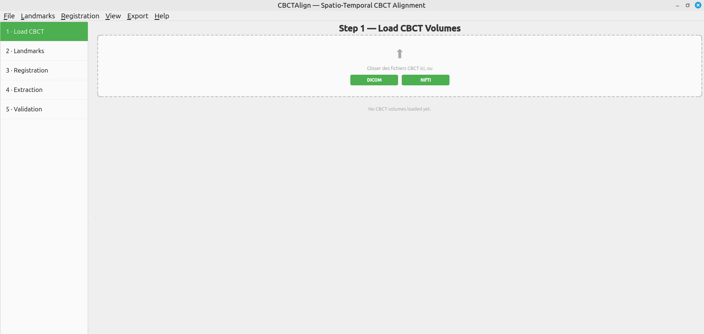
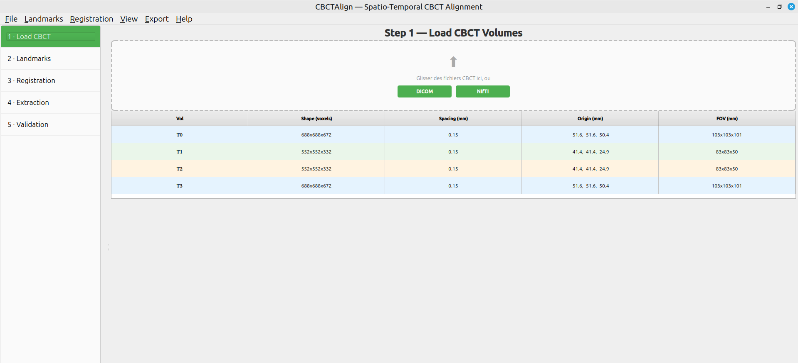
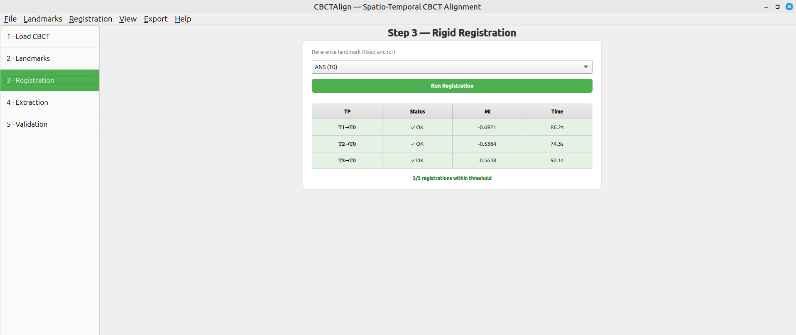
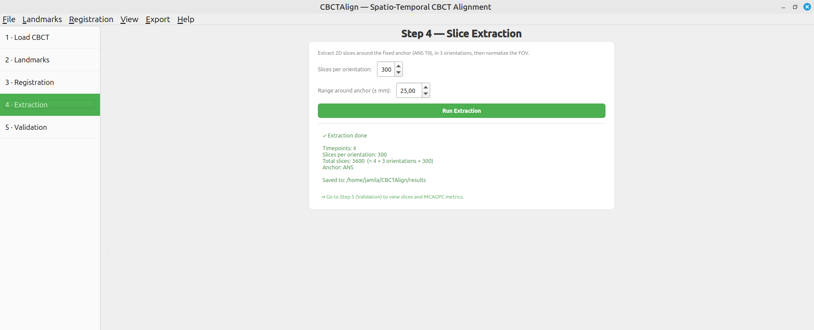
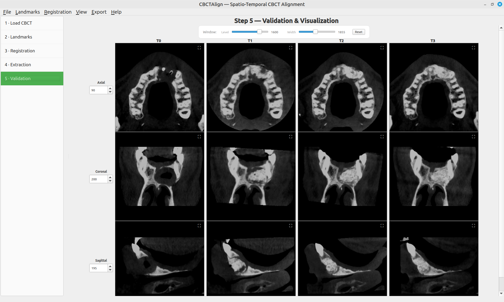

# CBCTAlign

Automated spatio-temporal alignment of longitudinal CBCT scans for maxillofacial bone regeneration assessment, in a few clicks.

**CBCTAlign** is an open-source C++/Qt desktop application for the spatio-temporal alignment of longitudinal cone-beam computed tomography (CBCT) volumes. It provides a guided workflow — from cephalometric landmark import to validated 2D slice comparison — for the quantitative follow-up of maxillofacial bone regeneration after implant placement, sinus lifting, alveolar grafting, or Guided Bone Regeneration (GBR) procedures.

---

## Table of Contents

- [Software Architecture](#software-architecture)
- [Key Features](#key-features)
- [Dependencies](#dependencies)
- [Getting Started](#getting-started)
- [Usage](#usage)
- [Configuration](#configuration)
- [Output Structure](#output-structure)
- [Contributing](#contributing)
- [License](#license)

---

## Software Architecture

CBCTAlign adopts a modular architecture that cleanly separates the **graphical user interface** (Qt Widgets), the **core image-processing pipeline** (registration, slice extraction, FOV normalization), the **validation module** (MCAGPC metric), and the **output generation layer** (aligned NIfTI volumes, PNG slice series, CSV reports). This design enables independent development of each component and future extension to additional registration methods, landmarks, or metrics.

The processing pipeline executes five sequential stages:

1. **Loading & preprocessing** — DICOM/NIfTI loading via DCMTK and ITK I/O, isotropic resampling, and median filtering.
2. **Landmark import** — parsing of ALI_CBCT JSON markup files, with optional manual refinement.
3. **Landmark-initialized rigid registration** — translation initialized from cephalometric landmarks, then refined by Mattes Mutual Information over a 3-level multi-resolution pyramid.
4. **2D slice extraction & FOV normalization** — axial, coronal, and sagittal slices centered on the reference landmark, normalized across heterogeneous CBCT protocols.
5. **MCAGPC validation & export** — composite quality metric (SSIM, NCC, landmark displacement) and structured output.

### Key Components

1. **CBCT I/O:** DICOM and NIfTI loading via DCMTK and ITK.
2. **Registration Engine:** ITK-based landmark-initialized multi-resolution rigid registration (Mattes MI).
3. **Validation Module:** MCAGPC composite metric combining structural similarity, cross-correlation, and anatomical landmark displacement.
4. **Interactive GUI:** Qt-based five-step interface with a synchronized multi-timepoint viewer.

---

## Key Features

- **Landmark-initialized rigid registration** — uses cephalometric landmarks (ANS, Sella, Nasion, PNS) from [ALI_CBCT](https://github.com/lucanchling/ALI_CBCT) JSON markup files to initialize Mattes Mutual Information optimization, preventing convergence to local minima.
- **Multi-resolution 3D rigid registration** — ITK-based pipeline with a 3-level pyramid (shrink factors 4, 2, 1).
- **Automatic FOV normalization** — handles heterogeneous CBCT acquisition protocols (large craniofacial FOV vs. reduced dental FOV).
- **Anatomically guided 2D slice extraction** — axial, coronal, and sagittal slices centered on a user-selected reference landmark.
- **MCAGPC composite validation metric** — combines SSIM, normalized cross-correlation (NCC), and post-registration landmark displacement.
- **Synchronized multi-timepoint viewer** — interactive 3×N grid view (3 orientations × N timepoints) for longitudinal inspection.
- **Structured PNG export** — ready-to-use 2D slice series for downstream deep learning pipelines.

---

## Dependencies

| Library  | Version | Role |
|----------|---------|------|
| ITK      | 5.2     | Image registration, resampling, Mattes MI metric, multi-resolution pyramid |
| Qt       | 5.15    | Graphical user interface (Widgets, Core, GUI modules) |
| VTK      | 9.0     | 3D volume visualization (optional) |
| DCMTK    | 3.6     | DICOM file I/O |
| Eigen    | 3.4     | Linear algebra for transformation matrices |
| CMake    | ≥ 3.16  | Cross-platform build system |

**Compilers tested:** GCC 9+ (Linux), MSVC 2019+ (Windows)
**Operating systems tested:** Ubuntu 20.04+, Ubuntu 24.04, Windows 10+

---

## Getting Started

### Prerequisites

1. **Git** — install from [git-scm.com](https://git-scm.com/) if needed.
2. **Build tools** — a C++17 compiler (GCC 9+ or MSVC 2019+) and CMake ≥ 3.16.
3. **Libraries** — Qt 5.15, ITK 5.2, VTK 9.0, DCMTK 3.6, Eigen 3.4.
4. *(Optional)* [ALI_CBCT](https://github.com/lucanchling/ALI_CBCT) + 3D Slicer, only if you wish to detect landmarks yourself. If you already have landmark JSON files, ALI_CBCT is not required.

### Steps

**Linux (Ubuntu 20.04+)**

\`\`\`bash
# 1. Clone and install system dependencies
git clone https://github.com/elmoubarakijamila/CBCTAlign.git
cd CBCTAlign
chmod +x install_dependencies.sh
./install_dependencies.sh

# 2. Build with CMake
mkdir build && cd build
cmake ..
make -j\$(nproc)

# 3. Run
./CBCTAlign
\`\`\`

**Windows 10+**

\`\`\`bash
# Requires Qt 5.15, ITK 5.2, VTK 9.0, DCMTK 3.6, CMake 3.16+ (via vcpkg or manual install)
git clone https://github.com/elmoubarakijamila/CBCTAlign.git
cd CBCTAlign
mkdir build && cd build
cmake .. -G "Visual Studio 16 2019"
cmake --build . --config Release
\`\`\`

---

## Usage

CBCTAlign is organized as five sequential steps shown in the left-hand sidebar.

### Step 1 — Load CBCT Volumes
Import the longitudinal acquisitions via **File → Open NIfTI** (or **Open DICOM**), one file per timepoint. Each loaded volume appears in a summary table showing its shape (voxels), spacing (mm), origin, and field of view. Volumes are labeled T0, T1, T2, … in acquisition order.

### Step 2 — Cephalometric Landmarks
Import the ALI_CBCT JSON markup files via **File → Load Landmarks JSON**, one per timepoint. CBCTAlign extracts the landmark coordinates and populates a color-coded table with the name, abbreviation, and (x, y, z) position in millimeters for each timepoint.

### Step 3 — Rigid Registration
Select the reference anchor (default: ANS at T0) and click **Run Registration**. Each moving volume is initialized from the landmark displacement, then refined by maximizing Mattes Mutual Information over a 3-level multi-resolution pyramid (shrink factors 4, 2, 1). The results table reports convergence status, final Mutual Information, and registration time per timepoint.

### Step 4 — Slice Extraction
Set the number of slices per orientation and the range (± mm) around the anchor, then click **Run Extraction**. CBCTAlign extracts axial, coronal, and sagittal slices centered on the reference landmark for every timepoint, then normalizes the field of view across timepoints. A summary reports the number of timepoints, slices per orientation, and total slices saved.

### Step 5 — Validation & Visualization
The synchronized grid viewer displays the aligned 2D slices (three orientations × N timepoints). Each orientation has an independent slice index, Window/Level controls adjust contrast, and any panel can be opened in a zoom dialog. The MCAGPC metric is computed per orientation to quantify alignment quality.

---

## Configuration

CBCTAlign reads two optional environment variables so that no machine-specific paths are hard-coded:

| Variable | Purpose | Default if unset |
|----------|---------|------------------|
| \`CBCTALIGN_DATA_DIR\` | Folder where file dialogs open by default (your CBCT data and results). | \`~/CBCTAlign_data\` |
| \`ALI_CBCT_HOME\` | Folder containing your ALI_CBCT install (only needed for in-app landmark detection). | \`~/ALI_CBCT_home\` |

\`\`\`bash
echo 'export CBCTALIGN_DATA_DIR="\$HOME/path/to/your/data"' >> ~/.bashrc
echo 'export ALI_CBCT_HOME="\$HOME/path/to/your/ALI_CBCT"' >> ~/.bashrc
source ~/.bashrc
\`\`\`

If unset, CBCTAlign still runs — dialogs simply open at the default locations.

---

## Output Structure

After extraction, results are written under your chosen output folder using a structured naming scheme:

\`\`\`
results/
├── T0_aligned.nii.gz          # aligned volume, timepoint 0
├── T1_aligned.nii.gz
├── ...
├── T0/
│   ├── Axial/slice_000.png ... slice_NNN.png
│   ├── Coronal/slice_000.png ...
│   └── Sagittal/slice_000.png ...
├── T1/
│   └── ...
└── ...
\`\`\`

Aligned volumes are saved in NIfTI format; 2D slices are saved as PNG series with consistent naming (\`T<i>/<Orientation>/slice_<index>.png\`), ready for downstream deep learning pipelines.

---

## Contributing

Contributions are welcome. Please fork the repository and submit a pull request.

### Contributors

- Jamila Elmoubaraki ([ORCID](https://orcid.org/))
- Omar Boutkhoum ([ORCID](https://orcid.org/0000-0002-0945-7520))
- Hamid El Byad ([ORCID](https://orcid.org/))

Developed at the **LAROSERI Laboratory**, Department of Computer Science, Faculty of Sciences, Chouaib Doukkali University, El Jadida, Morocco, in collaboration with the Dental Clinic, Casablanca.

---

## License

This project is licensed under the **MIT License**. You are free to use, modify, and distribute this software as long as the original license terms are respected. See the [LICENSE](LICENSE) file for details.

For questions, contact **elmoubaraki.jamila@ucd.ac.ma** or open an issue on the [GitHub repository](https://github.com/elmoubarakijamila/CBCTAlign/issues).
